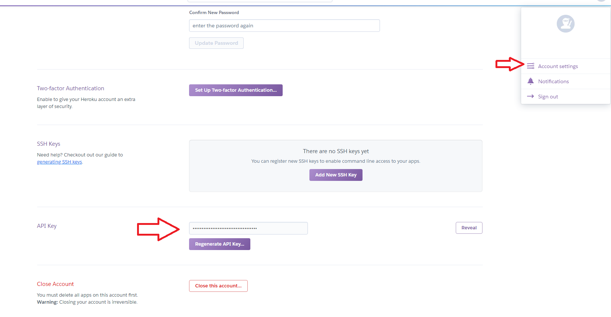
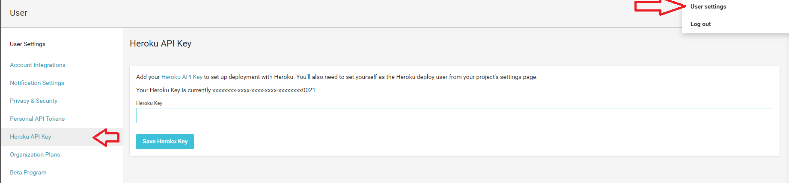
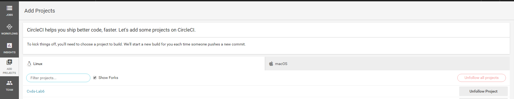
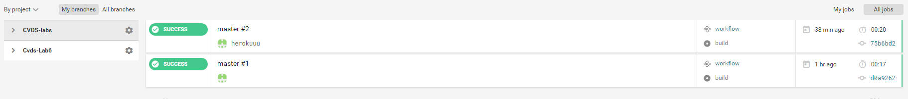

**CVDS LABORATORIO 6**
=======================

NOMBRES
--------
> Jonatan Esteban González Rodríguez
>
> Luisa Fernanda Sarmiento León

## Integración contínua con CircleCI y Heroku

En este laboratorio usamos la parte del juego que teniamos en el laboratorio 4, cogiengo el pom y la carpeta src

Posteriormente creamos la cuenta en ([Heroku](https://www.heroku.com))

Al tener la cuenta ya creada, sa saca la clave API 



Ingresamos a la plataforma de ([Circle.CI](https://circleci.com)) y la unimos con GitHub, al finalizar la union agregamos un proyecto(El de la pagina web)




Para esto cremos la carpeta .circleci y dentro de esta creamos el archivo config.yml

````

# Java Maven CircleCI 2.0 configuration file
#
# Check https://circleci.com/docs/2.0/language-java/ for more details
#
version: 2
jobs:
  build:
    docker:
      # specify the version you desire here
      - image: circleci/openjdk:8-jdk

      # Specify service dependencies here if necessary
      # CircleCI maintains a library of pre-built images
      # documented at https://circleci.com/docs/2.0/circleci-images/
      # - image: circleci/postgres:9.4

    working_directory: ~/gdj
    

    environment:
      # Customize the JVM maximum heap limit
      MAVEN_OPTS: -Xmx3200m

    steps:
      - checkout

      # Download and cache dependencies
      - restore_cache:
          keys:
            -  v1-dependencies-{{ checksum "pom.xml" }}
            # fallback to using the latest cache if no exact match is found
            # - v1-dependencies-

      - run: mvn dependency:go-offline  
      

      - save_cache:
          paths:
            - ~/.m2
          key:  v1-dependencies-{{ checksum "pom.xml" }}

      # run tests!
      - run: mvn integration-test  

````
Al terminar comprobamos que todo corriera con exito 



Si todo queda correctamente configurado, cada vez que se haga un PUSH al repositorio, CircleCI ejecutará la fase de construcción del proyecto. Para que cuando las pruebas pasen automáticamente se despliegue en Heroku, debe definir en el archivo circle.yml (ubicado en la raíz del proyecto):
````
machine:
  java:
    version: oraclejdk8

deployment:
  staging:
    branch: master
    heroku: 
      appname: appluisajonatan
````

	* La rama del repositorio de GitHUB que se desplegará en Heroku. o El nombre de la aplicación de Heroku en la que se hará el despliegue.
	
Heroku requiere los siguientes archivos de configuración (con sus respectivos contenidos) en el directorio raíz del proyecto, de manera que sea qué versión de Java utilizar, y cómo iniciar la aplicación, respectivamente:

system.properties

```
java.runtime.version=1.8
```

Procfile 

```
web:    java $JAVA_OPTS -jar target/dependency/webapp-runner.jar --port $PORT target/*.war
```
	
Se miro si la aplicación corria de manera correcta ([Game heroku](https://dashboard.heroku.com/apps/app1luisajonatan/deploy/github))

Por ultimo se valalido la calidad del codigo con CODACY

[

[
